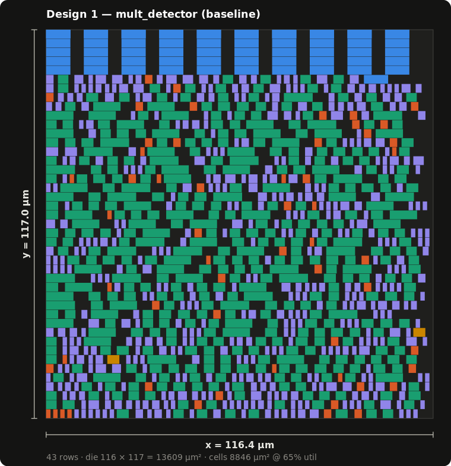
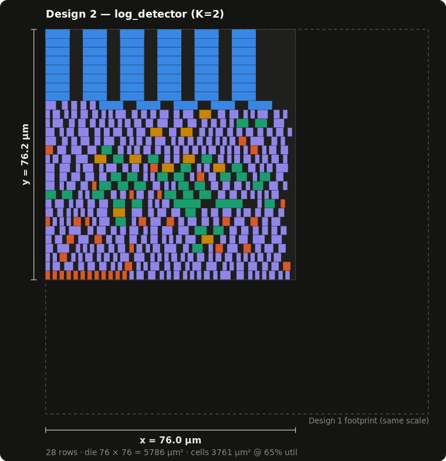

# Eliminating Multipliers with Log / LNS Arithmetic — SkyWater 130 nm

### ▶ [**View the interactive page**](https://borenw.github.io/sky130-lns-mac-detector/) — rendered HTML (diagrams, tables, worked examples) in your browser

Two RTL designs of the **same function** — `out = (A·B + C·D) > Vth`, with
**10-bit** inputs (`A,B,C,D` ∈ 0…1023, 21-bit `Vth`) — built, verified,
synthesized on the open-source **sky130** HD standard-cell library, and compared
on **area and power**:

- **Design 1 (baseline):** exact multiplier — `A*B + C*D`, one comparator.
- **Design 2 (K=2 log / LNS):** *no multipliers*. Each input goes through a
  leading-one detector + **2 mantissa bits** (K=2 log2), logs are added, combined with an
  LNS add `s = max(x,y) + F(|x−y|)` (small ROM), and compared in the log domain.

📄 **[Live page (rendered)](https://borenw.github.io/sky130-lns-mac-detector/)** · full writeup in
[`report/SUMMARY.md`](report/SUMMARY.md)

## Result

| Metric | Design 1 · multiplier | Design 2 · log K=2 | Design 2 / 1 |
|---|--:|--:|--:|
| Standard-cell area | 8845.98 µm² | **3761.11 µm²** | 0.422× (**−57.5%**) |
| Die size (x × y @65%) | 116.4 × 117.0 µm | **76.0 × 76.2 µm** | −57.5% |
| Std-cell count | 1019 | **483** | 0.474× |
| Multipliers (`$mul`) | 2 | **0** | eliminated |
| Energy / op (est.) | 6.794 pJ | 2.865 pJ | 0.422× |
| Power @ 50 MHz (est.) | 339.67 µW | **143.23 µW** | 0.422× (**−57.8%**) |
| Accuracy vs exact | reference | ≈2.84 % disagree | K=2 cost |
| Verification | PASS (= `exp_exact`) | PASS (= `exp_k1`) | both bit-exact |

**Takeaway:** dropping the two 10-bit multipliers for the K=2 log detector cuts area
~58 % and estimated power ~58 %, at a **≈2.8 % disagreement** with exact math
(concentrated in the mid dynamic range, zero at the extremes). Vs the 12-bit/K=1 build
(−70 %/−74 % at 5.6 %), the area saving is smaller — the multiplier is cheaper at 10-bit
and K=2 adds a little logic — but the second mantissa bit roughly **halves** the error.

### Standard-cell floorplans (measured die x × y, same scale)

| Design 1 — multiplier | Design 2 — log K=2 |
|---|---|
|  |  |

Both dies are drawn at the **same scale** — Design 2's dashed frame is Design 1's
footprint, so the ~2.4× area difference is literal. Colored by cell function:
🔵 flip-flops · 🟢 adder (xor/maj) · 🟡 mux · 🟣 logic · 🟠 clk/buf. The multiplier is
dominated by adder cells; the log design replaces them with logic + a small ROM/mux.

> **Note on the layout:** no place-and-route tool (OpenROAD/Innovus) was available on the
> build host, so the die x/y is a **standard-cell floorplan estimate** — the real
> synthesized cells packed into 2.72 µm rows at 65 % utilization — **not a routed
> layout**. A real `.gds` bounding-box file is emitted per design. The
> Design-2/Design-1 **ratio** is robust; the absolute x/y scales with the utilization
> assumption. Routed numbers would come from OpenROAD/OpenLane + OpenSTA.

## Reproduce

Needs `iverilog`, `yosys` (or `yowasp-yosys`), `python3`+`numpy`; `gdstk`+`cairosvg`
for the layout/page.

```bash
./run.sh                          # phases 1–7: model → verify → synth → power → floorplan → page
# or individual pieces:
python3 model/model.py            # golden model + emits rtl/lns_ftable.v (F-ROM)
# ... yosys synth via synth/run_*.ys ...
python3 model/floorplan.py        # die x/y + synth/*.gds + report/*_layout.svg
python3 model/build_page.py       # docs/index.html
```

## Layout

```
rtl/     mult_detector.v · log_detector.v · lod5.v · lns_add.v · lns_ftable.v (generated)
model/   model.py (golden + ROM gen) · power_area.py · floorplan.py · build_page.py
verif/   tb.v · vectors.csv · sim_report.txt
synth/   run_mult.ys · run_log.ys · *_netlist.v · *.gds · sky130_*.lib
report/  SUMMARY.md · model_accuracy.txt · elaboration.txt · power_area.csv · floorplan.csv · *_layout.svg
docs/    index.html (GitHub Pages) · layout PNGs
```

## Method notes

- **One golden model, no drift:** `model.py` is the spec for *both* designs and
  **emits the `F(d)` ROM** consumed by the Verilog, so model and hardware can't diverge.
- **Design 2's "correct" answer is the K=2 model, not exact math.** RTL is checked
  bit-exact to `out_k1` (0 mismatches / 58,139 vectors); disagreement with exact math
  is the *approximation cost*, reported separately. `WIDTH` and `K` are RTL/model
  parameters — this build is `WIDTH=10, K=2`.
- **No latches, no multipliers** in Design 2 (yosys audit); both netlists fully mapped
  to sky130 cells with zero `$`-cells.
- Power is an analytic switching estimate `E = α(1+wire)·ΣCin·Vdd²`
  (Vdd=1.8 V, α=0.15, wire=1.0×, f=50 MHz); the ×baseline ratio is the robust figure.

## Physical design (PnR / DRC / LVS)

The synthesized numbers above are **logical** (area from `stat`, power analytic). A real
**routed GDS + DRC-clean + LVS-clean** signoff needs OpenLane/OpenROAD + Magic/Netgen and
the physical sky130 PDK — **not installed on the build host**, so none are faked here.
`pnr/` ships ready-to-run OpenLane configs (`config_log.json`, `config_mult.json`),
`run_pnr.sh`, and a Magic DRC script to produce them on a toolchain host; current status
is in [`report/DRC_LVS_STATUS.txt`](report/DRC_LVS_STATUS.txt).

*Standard-cell liberty `sky130_fd_sc_hd__tt_025C_1v80.lib` © Google/SkyWater, Apache-2.0.*
